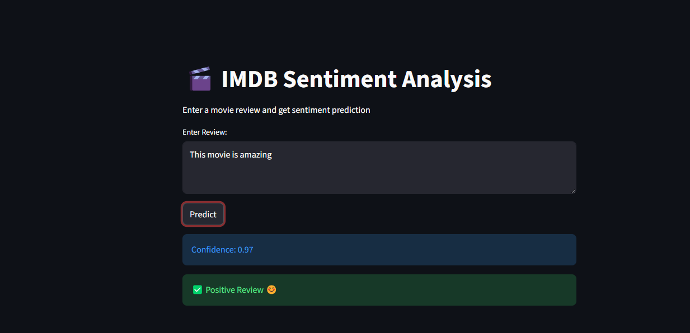
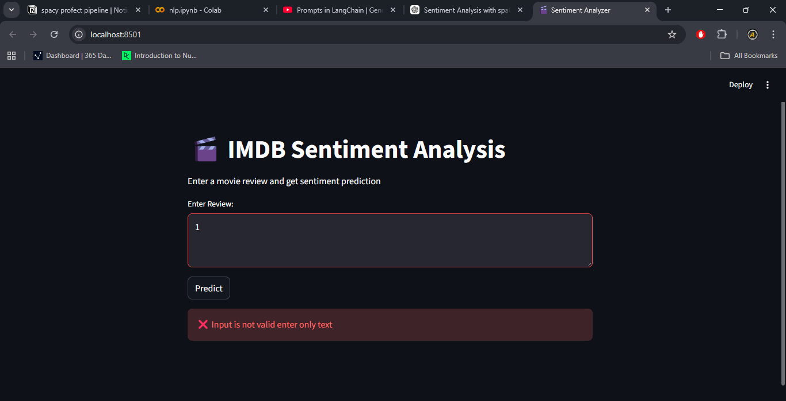

# IMDB Sentiment Analysis (NLP + Streamlit)


End-to-End NLP + Machine Learning Project with real-time deployment using Streamlit
Classifies movie reviews as **Positive or Negative**

---

## Overview

This project implements a complete **Sentiment Analysis System** using Natural Language Processing (NLP) and Machine Learning techniques, deployed as an interactive **Streamlit web application**.

The system:

* Cleans raw user input
* Applies NLP preprocessing using **spaCy**
* Converts text into numerical vectors using **TF-IDF**
* Predicts sentiment using a trained **Logistic Regression model**

---

## System Architecture

```
User Input (Review)
        ↓
Text Cleaning (URL + HTML Removal)
        ↓
spaCy NLP Pipeline (Tokenization + Lemmatization)
        ↓
TF-IDF Vectorization (n-grams)
        ↓
Logistic Regression Model
        ↓
Prediction + Confidence Score
```

---

## Workflow Explanation

### 1. Input Layer

* User enters a movie review via UI
* Input validation ensures meaningful text

### 2. Preprocessing Layer

* Remove URLs and HTML tags
* Tokenization using spaCy
* Stopword removal
* Lemmatization

### 3. Feature Engineering

* Convert text into vectors using **TF-IDF**
* Use **n-grams (1,2)** to capture context

### 4. Model Layer

* Logistic Regression performs classification
* Outputs:

  * Sentiment (Positive / Negative)
  * Confidence score

---

## Model Performance

| Metric     | Value               |
| ---------- | ------------------- |
| Algorithm  | Logistic Regression |
| Vectorizer | TF-IDF              |
| N-grams    | (1,2)               |
| Accuracy   | **~89–90%**         |
| Dataset    | IMDB Movie Reviews  |

* Balanced precision and recall
* Strong performance for classical NLP

---

## Streamlit Application

### Run the App

```bash
streamlit run app.py
```

### Features

* Clean UI
* Real-time predictions
* Confidence score display
* Input validation
* Handles invalid inputs

---

## Demo

### Positive Prediction



### Invalid Input Handling



---

## Project Structure

```
imdb-sentiment-analysis/
│
├── app.py
├── model.pkl
├── vectorizer.pkl
├── requirements.txt
├── README.md
│
├── Notebooks/
│   └── nlp.ipynb
│
├── screenshot/
│   ├── image.png
│   ├── image-3.png
│
├── tests/
│   └── testing.py
```

---

## Setup Instructions

### 1. Clone Repository

```bash
git clone https://github.com/your-username/imdb-sentiment-analysis.git
cd imdb-sentiment-analysis
```

### 2. Create Virtual Environment

```bash
python -m venv venv
```

### 3. Activate Environment

**Windows:**

```bash
venv\Scripts\activate
```

**Linux/Mac:**

```bash
source venv/bin/activate
```

### 4. Install Dependencies

```bash
pip install -r requirements.txt
```

### 5. Download spaCy Model

```bash
python -m spacy download en_core_web_sm
```

### 6. Run App

```bash
streamlit run app.py
```

---

## Requirements

* Python 3.8+
* streamlit
* scikit-learn
* pandas
* numpy
* spacy

---

## Example Predictions

| Input Review          | Output     |
| --------------------- | ---------- |
| This movie is amazing | Positive |
| Worst film ever       | Negative |
| Not bad, pretty good  | Positive |

---

## Limitations

* TF-IDF is **keyword-based**, not semantic
* May struggle with complex sentence structures
* Example: *"better than others"* may misclassify

---

## Training Pipeline

1. Load IMDB dataset
2. Clean and preprocess text
3. Apply TF-IDF vectorization
4. Train Logistic Regression
5. Evaluate performance
6. Save model using pickle

---

## Future Improvements

* Upgrade to BERT / Transformers
* Build Semantic Search System
* Deploy on Streamlit Cloud
* Add multilingual support

---

## Tech Stack

* Python
* spaCy
* Scikit-learn
* Pandas & NumPy
* Streamlit

---

## Live Demo

Coming Soon (Streamlit Cloud Deployment)

---

## Author

**Aakash Kumar**
B.Tech CSE (Data Science)
Aspiring Data Scientist

---

## Support

If you like this project:

* Star the repo
* Share with others
